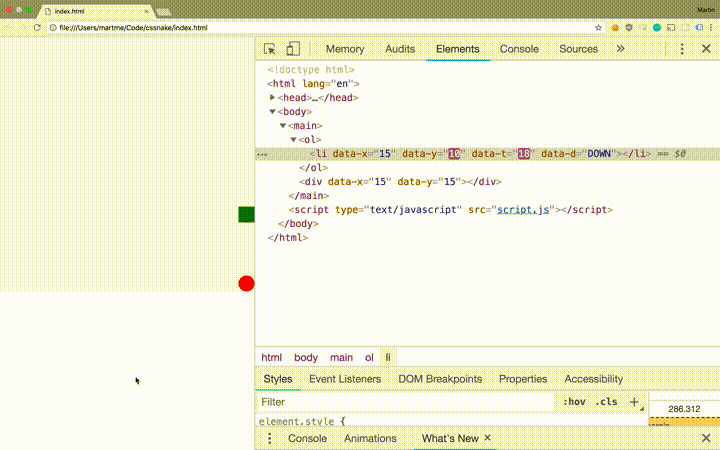

# Simple game of Snake in CSS

The snake is represented as an ordered collection of list items, 
decorated with html-attributes - the html-attributes are recognized
by the stylesheet which uses animations to make the snake move.

< 100 lines of spaghetti javascript makes sure the attributes are 
updated to the correct values after each animation iteration.

Why? Because inspecting the DOM while playing is mesmerizing!

